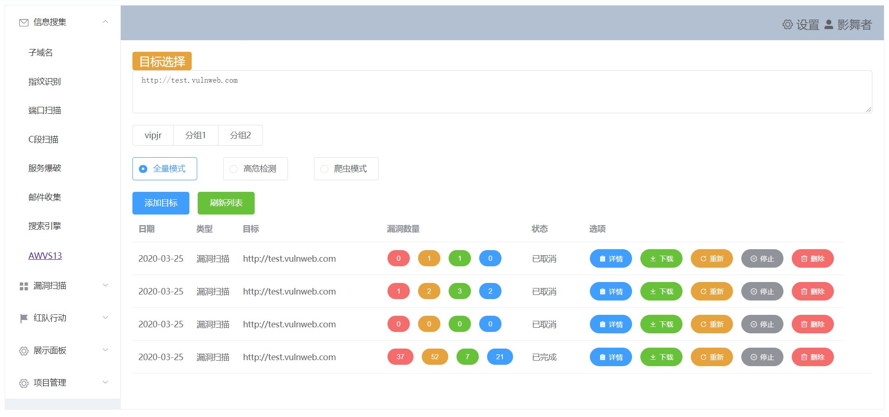
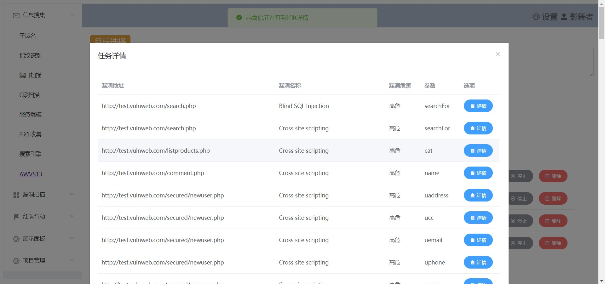
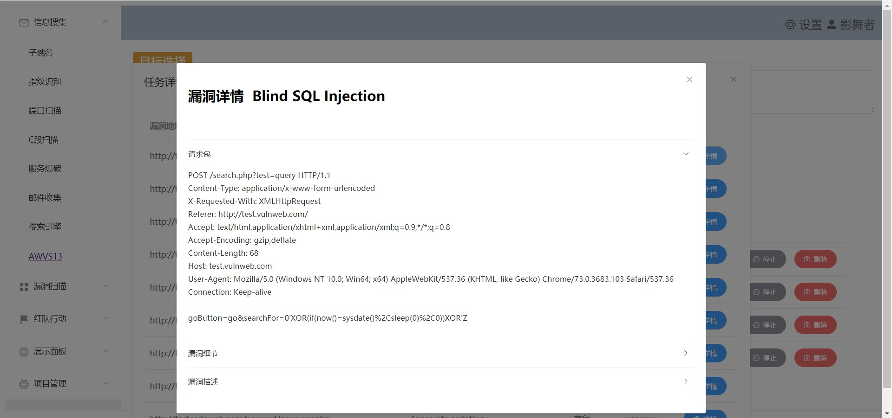
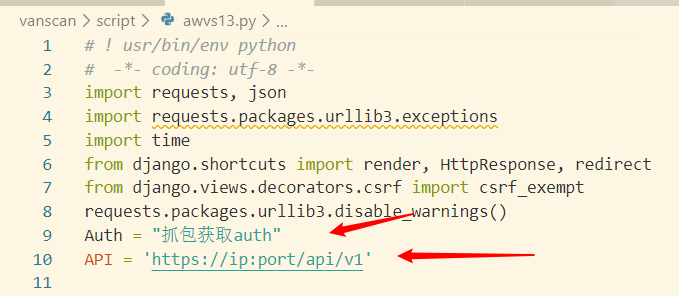

# vanscan
打算做一个信息搜集、扫C段、指纹识别、漏洞扫描的轮子  
目前后端使用了django,前端使用了element+vue
## awvs接口
[+]根据渗透习惯，新增了扫描模式。扫描模式可选`默认模式`和`高危模式`（默认模式=全量扫描，高危模式=只扫高风险漏洞）  
[+]新增`目标分组`，默认选择不分组，支持添加多个分组   
[+]一键查看`任务详情`，可显示漏洞名称、漏洞风险、漏洞url   
[+]一键查看`漏洞详情`，可显示漏洞细节、请求包
[+]一键`导出报告`，默认保存pdf在`报告`目录   
[+]一键`重新扫描`目标   
[+]支持`批量添加目标`   
调用awvs12或awvs13

